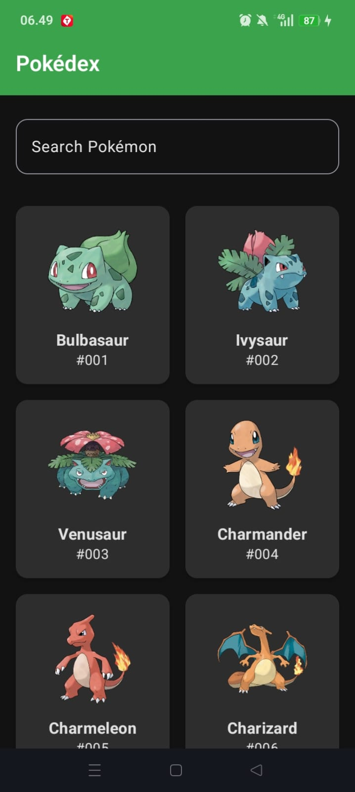
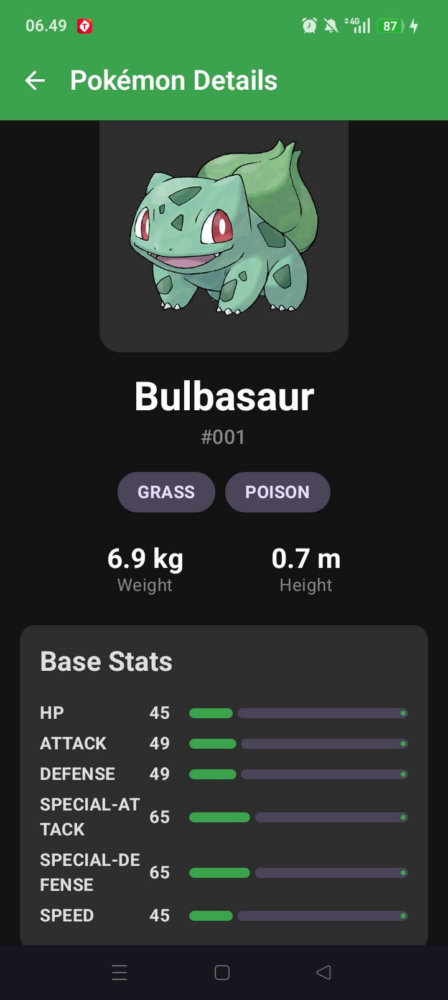

# Pokédex App
> Aplikasi Katalog dan Eksplorasi Pokémon

---

## 👤 Identitas Praktikan
- **Nama Lengkap:** Afkar Aufaa Farros
- **NIM:** H1D024085
- **Shift Awal:** Shift-C
- **Shift Akhir:** Shift-E
- **Link Video Demo/Penjelasan:** [Tambahkan link video di sini](https://...)

---

## 📱 Deskripsi Aplikasi
Pokédex App adalah aplikasi mobile interaktif berbasis Android yang memungkinkan pengguna untuk mencari, melihat, dan mengeksplorasi informasi mendetail mengenai berbagai jenis Pokémon. Aplikasi ini menyelesaikan masalah sulitnya mendapatkan detail statistik, tipe, berat, dan tinggi karakter Pokémon secara cepat. Dengan antarmuka modern yang ramah pengguna, siapa saja dapat menjadi *Pokémon Master*!

---

## 🛠️ Penjelasan Teknis

### 1. Spesifikasi & Tech Stack
- **Bahasa:** Kotlin
- **UI Framework:** Jetpack Compose (Material 3)
- **Min SDK:** 29 | **Target SDK:** 37
- **Pola Arsitektur:** MVVM (Model-View-ViewModel) / Clean Architecture
- **Library Utama:**
  - `Navigation Compose` (Routing halaman)
  - `ViewModel` & `StateFlow` (State Management)
  - `Retrofit` & `Gson` (Networking / REST API)
  - `Coil` (Image Loading)
  - `Kotlin Coroutines` (Asynchronous processing)

### 2. Fitur Utama
- **Fitur 1 - Daftar dan Grid Pokémon:** Mengambil daftar lebih dari 150 Pokémon pertama melalui PokeAPI menggunakan Retrofit. Data di-parse secara otomatis melalui data class Gson dan direpresentasikan secara mulus tanpa *lag* menggunakan `LazyVerticalGrid`.
- **Fitur 2 - Filter dan Pencarian Cerdas:** Pengguna dapat mencari Pokémon berdasarkan nama di *Search Bar*. Proses ini memanfaatkan filter data secara responsif di layer `ViewModel`, yang langsung memicu proses recomposition (pembaruan UI) via `StateFlow` di `PokemonHomeScreen`.
- **Fitur 3 - Layar Detail Komprehensif:** Saat item diklik, aplikasi melakukan *routing* sambil melempar argumen berupa ID Pokemon ke `PokemonDetailScreen`. Layar secara mandiri mengatur state (*Loading*, *Success*, *Error*) sambil memuat data secara asynchronous untuk menampilkan berat, tinggi, tipe, dan statistik stat (ditampilkan menggunakan *LinearProgressIndicator* Material3).

### 3. Struktur Direktori Proyek
Struktur proyek ini menerapkan standar Modern Android Architecture (MVVM Layer):
```text
app/src/main/java/com/example/praktikkummobile/
├── data/
│   ├── model/       # Data Class / Entity (Pokemon, PokemonDetail)
│   ├── remote/      # Konfigurasi Retrofit & API Service
│   └── repository/  # Jembatan pengambil data (PokemonRepository)
├── ui/
│   ├── components/  # (Bisa diisi reusable Compose blocks)
│   ├── screens/     # Screen Composable UI + ViewModel (PokemonHomeScreen, DetailScreen, ViewModel)
│   └── theme/       # Color, Type, Theme bawaan Material 3
└── MainActivity.kt  # Entry-point utama + Navigation Routing
```

---

## 📸 Tangkapan Layar (Screenshots)

| Layar Utama (Daftar & Search) | Layar Detail Pokemon |
|:---:|:---:|
|  |  |

---

## 🚀 Cara Menjalankan Proyek

1. **Prasyarat:**
   - Android Studio (Koala / Ladybug / versi terbaru disarankan).
   - JDK 11 atau lebih baru.
   - Perangkat fisik Android dengan USB Debugging aktif atau Emulator.

2. **Langkah:**
   ```bash
   # Clone repository
   git clone https://github.com/Charboros/PrakPemMob_Kotlin_H1D024085_AfkarAufaaFarros_Shift-E_Shift-C.git
   ```
3. Buka folder proyek di **Android Studio**.
4. Tunggu proses **Gradle Sync** selesai.
5. Pilih target perangkat/emulator, lalu klik tombol **Run (`Shift + F10`)**.
